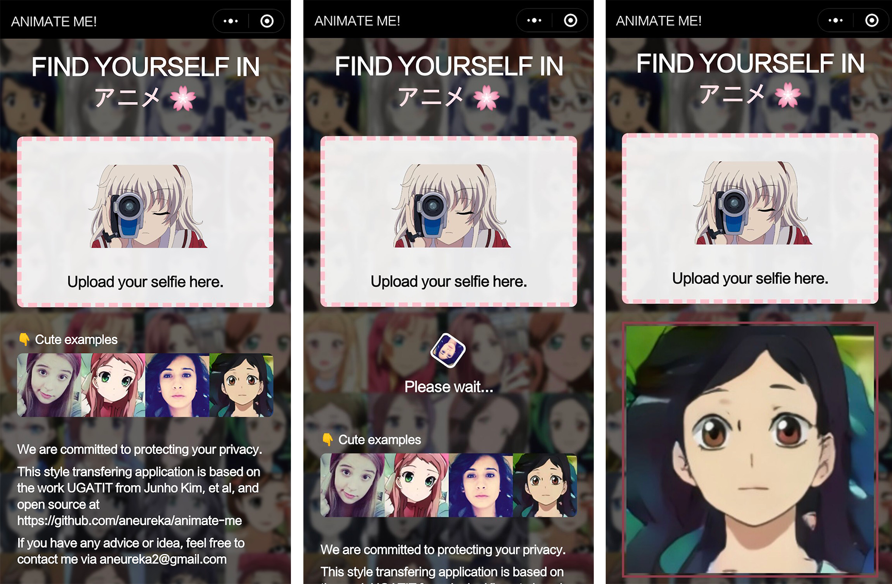

# ANIMATE ME!

`ANIMATE ME!` 可以将你的照片转成动画风格，再见，我去二次元了 🤣

## 运行截图

## 最新动态

由于 Google cloud 服务到期，且后端内存占用实在太大了（至少需要8G），超过了能够承担的范围，所以小程序服务现在已经关闭了，等哪天有能力买服务器用爱发电的时候会重新打开~

## 相关技术

小程序端使用 [Taro](http://taro-ui.aotu.io/) 编写 React 风格的代码，Taro 本身我非常喜欢，虽然生态还不成熟，但很有潜力

图片风格转换算法为来自于 [UGATIT](https://arxiv.org/abs/1907.10830)，最近（2019.07）发表的论文，在多种图片风格转换场景表现出 state of the art 的性能，尤其是 **selfie2anime**

后端技术栈为 Flask + Tensorflow，开源地址：https://github.com/Aneureka/UGATIT-s2a

## 一些计划

🙋 分享生成图片

🙋 图片裁剪（目前安卓上性能感人）

## 目前存在的问题

图片风格转换使用的预训练模型来自于 UGATIT 作者开放的 [selfie2anime checkpoint (100 epoch)](https://drive.google.com/file/d/19xQK2onIy-3S5W5K-XIh85pAg_RNvBVf/view?usp=sharing) ，由于训练集基本为西方女性和动漫女性角色，所以部分转换效果不是很好。考虑基于此加入更多样化的数据进行训练（但训练时间真的好长啊）。

